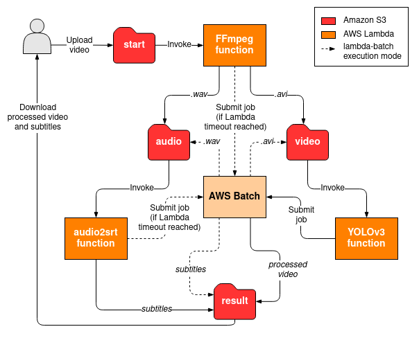
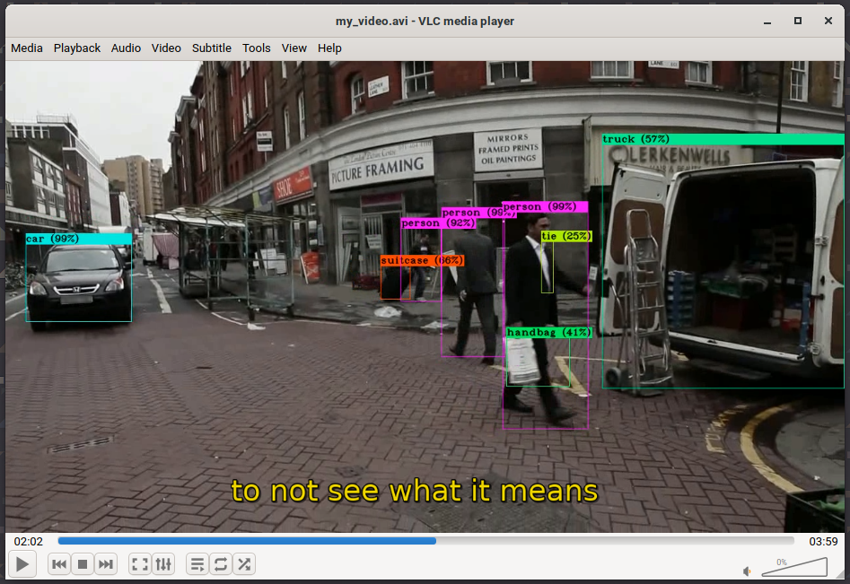

# GPU-enabled workflow for audio and video processing using AWS Lambda and AWS Batch

This example deploys a workflow to efficiently process videos in order to recognize objects through [YOLOv3](https://pjreddie.com/darknet/yolo/) and generate subtitle files from the extracted audio thanks to [audio2srt](https://gitlab.com/RunasSudo/audio2srt). Notice that, unlike the [video-process](https://github.com/grycap/scar/tree/dev-srisco/examples/video-process) example, the result of this workflow is a video with the prediction boxes together with a `.srt` subtitle file instead of the sum of pictures that compose the video.

The workflow is composed by the previously mentioned applications packaged as containers plus a FFmpeg function in charge of pre-processing the input videos, that is, extracting the audio to invoke the audio2srt function and, if necessary, convert the video to an appropiate format in order to be processed by the YOLOv3 function.

FFmpeg and audio2srt functions are deployed with the *lambda-batch* execution mode, that tries to perform the processing in AWS Lambda and, if the execution fails or the timeout is reached, delegates the execution to AWS Batch. On the other hand, YOLOv3 function is deployed to be executed exclusively on AWS Batch, defining a customized compute environment that uses the GPU-enabled `g3s.xlarge` instance type with the aim of benefiting from GPU acceleration.



All three functions are defined in the `scar-av-workflow.yaml` file. More information about the AWS Batch integration can be found in the [documentation](https://scar.readthedocs.io/en/latest/batch.html).

## Create the processing functions

To create the workflow you only need to execute one command:

```sh
scar init -f scar-av-workflow.yaml
```

## Launch the execution

In order to launch an execution you only have to upload a video to the defined *start* folder of the S3 bucket. In this case, the following command will start the execution:

```sh
scar put -b scar-av-workflow/start -p my_video.mkv
```

*A sample video can be downloaded [here](https://vimeo.com/44792497). Thanks [Alex Odam](https://vimeo.com/alexodam) for the video licensed under the [CC BY 3.0 license](https://creativecommons.org/licenses/by/3.0/).*

## Process the output

When the execution of the workflow finishes, two output files are uploaded to the result folder of the `scar-av-workflow` S3 bucket. To check if the files are created and copied correctly you can use the command:

```sh
scar ls -b scar-av-workflow/result
```

Which lists the following outputs:

```
result/my_video.avi
result/my_video.srt
```

The files are created in the output folder following the `s3://scar-av-workflow/result/*.*` structure.

To download the generated files you can also use SCAR with the following command:

```sh
scar get -b scar-video/output -p /tmp/video/
```

This command creates the `video/output` folder in the `/tmp` path, in which the resulting videos can be played along with their corresponding subtitle files:



## Delete the Lambda functions

Do not forget to delete the functions when you finish your testing:

```sh
scar rm -f scar-av-workflow.yaml
```

Have in mind that the bucket, the folders and the files created are not deleted when the function is deleted.

If you want to delete the bucket you have to do it manually using, for example, AWS CLI::

```sh
  aws s3 rb s3://scar-av-workflow --force
```
